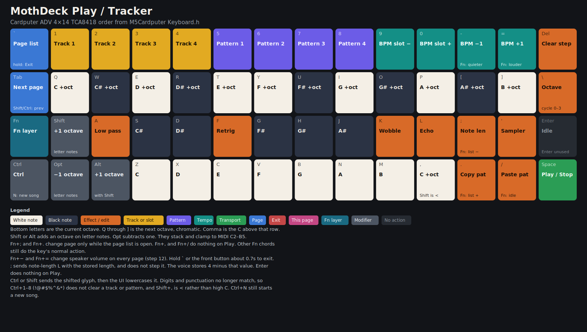
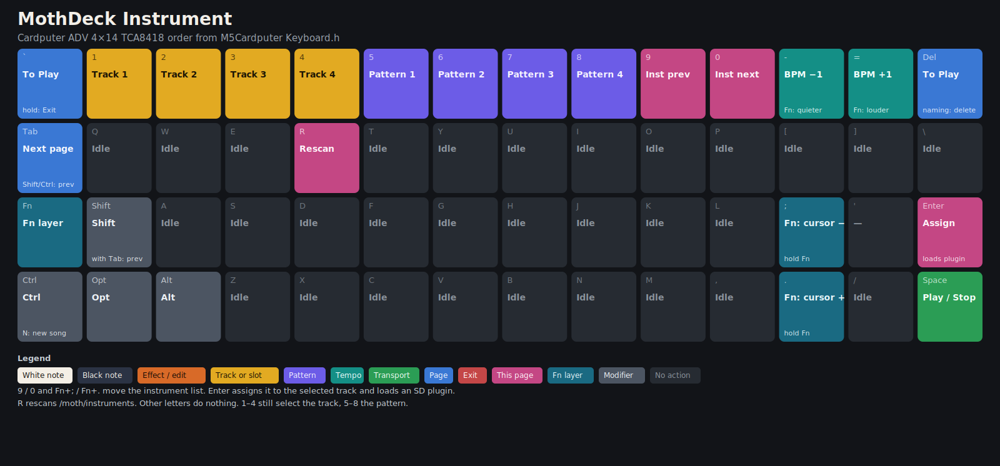
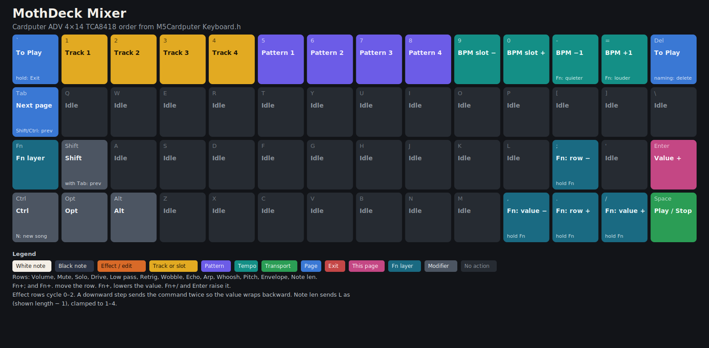
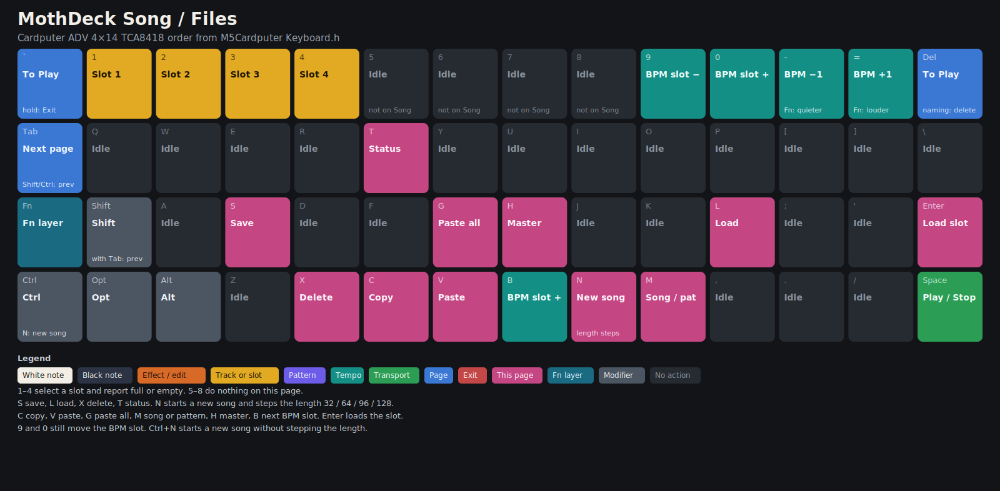
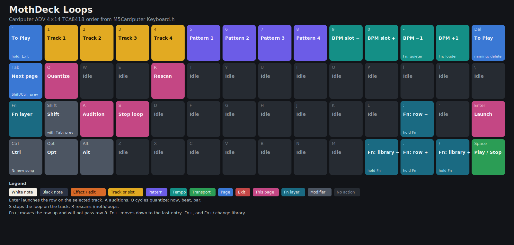
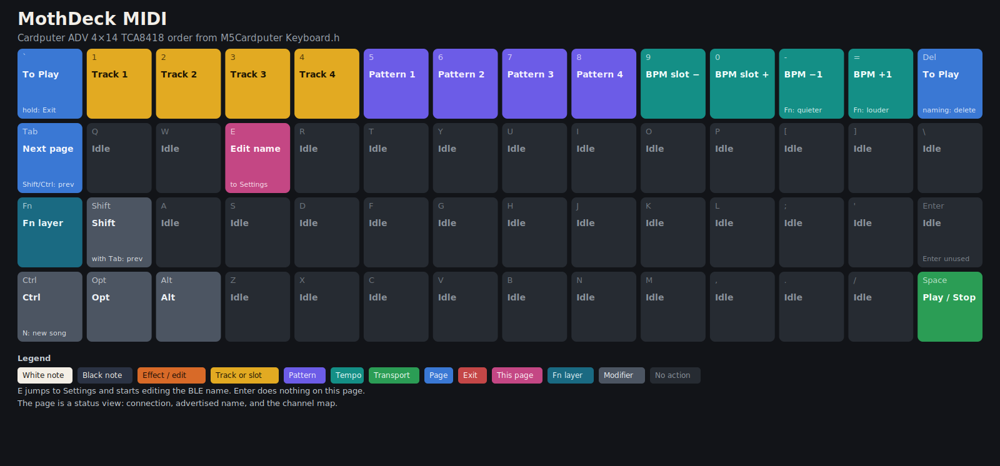
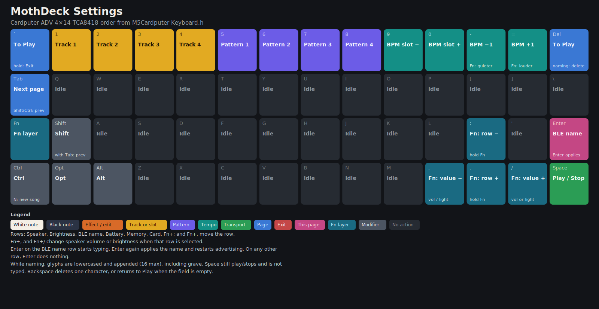
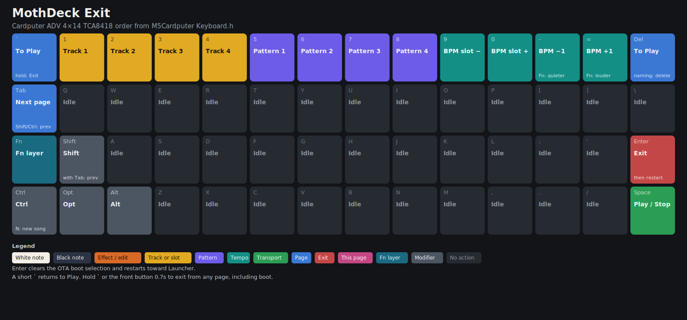

# MothDeck

MothDeck is a 4-track sampler and tracker for the [M5Stack Cardputer ADV](https://docs.m5stack.com/en/core/Cardputer-Adv). It is a sibling of [MothOS](https://github.com/MothSynths): same song file, same BLE MIDI map, same voice and effect model, redrawn for the ADV's 240×135 colour screen and 56-key keyboard.

Everything it uses is on the board. There is no wiring. The speaker, headphone jack, display, keyboard, and microSD are brought up by M5Unified. A card is optional; the built-in drums, sound effects, and instruments are synthesized at build time and are not recordings of anyone else's samples.

## Features

- 4 tracks, 4 patterns, up to 256 steps (16th notes). Step timing matches MothOS: 44100 Hz, one step is `11025 / beats-per-second` samples.
- 12 built-in instruments: drums, sound effects, sine, square, saw, triangle, organ, pluck, bell, flute, bass, pad.
- Per-track delay, low pass, phaser, retrig, overdrive, pitch, whoosh, and chord.
- BLE MIDI peripheral, default name `MothSynth` (change it on the Settings page). The name is stored in NVS.
- Song slots `/moth/slot1.mos` … `slot4.mos`. A song that stays on the built-in instruments is a 3155-byte MothOS version 1 file. Plugins and loops bump the file to version 2.
- Instrument folders and loop libraries loaded from the card, assigned per track, remembered in the song, and ignored cleanly when the file is missing or bad.
- Audio runs on its own FreeRTOS task on core 1. The UI never writes the tracker. The speaker is fed 256-frame blocks only while fewer than two blocks are queued.
- Battery percent and speaker volume on the status line. The ADV reads the pack on GPIO10.

## Build

PlatformIO, pioarduino 55.03.312-1 (Arduino-ESP32 3.3.12). Libraries are pinned: M5Unified 0.2.25, M5GFX 0.2.32, M5Cardputer 1.1.1.

```bash
pip install platformio
./build.sh
```

`build.sh` regenerates the built-in waveforms, the example card tree, runs the host tests, and writes:

- `releases/mothdeck-cardputer-adv.bin` — install this from Launcher
- `releases/mothdeck-cardputer-adv-full.bin` — USB flash only; it replaces Launcher
- `releases/SHA256SUMS`

Host tests alone:

```bash
bash tools/run_tests.sh
```

The dev environment `cardputer-adv-dev` adds serial logs for the card and the speaker.

The image is built `qio_qspi` at 80 MHz. That is the memory type on the Arduino-ESP32 `m5stack_cardputer` board (QIO flash, QSPI PSRAM type, PSRAM left disabled) and on Launcher's Cardputer environment. The Stamp-S3A is an ESP32-S3FN8: 8MB flash and no PSRAM. `qio_opi` would boot-init octal PSRAM on GPIO33–37, which this board uses for the display. Sample and loop caches call `psramFound()` and use internal RAM when no PSRAM answers, so the same binary still uses PSRAM if a later module has it. `-DBOARD_HAS_PSRAM` is not set, so M5GFX does not prefer a PSRAM heap that is not there.

## Install from Launcher

See [releases/INSTALL.md](releases/INSTALL.md) for the button-by-button steps. Short version: copy `mothdeck-cardputer-adv.bin` (the file that starts with `E9`) to a FAT32 card, boot Launcher, press Enter on the splash, and install the file from the SD browser.

### Why Exit works this way

Launcher lives in an `APP_TEST` partition and points `otadata` at the installed app (`launcherPartitionSetOtaBoot`). `esp_ota_set_boot_partition()` cannot select that test slot. In ESP-IDF 5.5 the call only erases `otadata` for a factory image; any other subtype is reduced to its low nibble, and `0x20` (TEST) becomes OTA slot 0. Calling it would boot the wrong image.

Exit erases `otadata`, which is what `launcherPartitionClearOtaBoot` does, then restarts. It refuses to restart when no other app partition exists, so a standalone USB flash does not reboot-loop if Esc is held at boot.

Hold Esc (`` ` ``) or the front button for about 0.7 seconds, or confirm the Exit page. The same hold during MothDeck's own boot runs the exit before the audio task starts. After the restart, press Enter on Launcher's splash ("Press the button to enter the Launcher!") to stay there. Doing nothing on that splash starts the installed app again whenever the boot selection still names it.

## Keyboard

The drawings follow `src/Ui.cpp` and the 4×14 matrix in M5Cardputer `Keyboard.h`. Regenerate them with `python3 tools/make_keymap.py` (needs CairoSVG). Each key shows the unshifted action. A caption on the key is the Fn action where that differs.

















Esc is the grave key. The arrow legends are `;` up, `,` left, `.` down, `/` right, and they only move something while Fn is held. Fn+`-` and Fn+`=` change speaker volume by 12 on every page. Fn plus any other key still does that key's normal action.

Ctrl or Shift substitutes the key's shifted glyph before the UI lowercases it. Letter commands still match. Digit and punctuation commands do not: Ctrl+1–8 is `!@#$%^&*` and does not clear a track or pattern, and Shift+`,` is `<` rather than the high C. Ctrl+N still starts a new song.

| Keys | Action |
| --- | --- |
| Tab | Next page. Shift+Tab or Ctrl+Tab goes to the previous page. Either clears the page list and leaves BLE naming |
| Space | Play / stop, including while a BLE name is being typed |
| `` ` `` tap | On Play, toggle the page list. On any other page, return to Play. Ignored while Fn is held or a name is being typed |
| `` ` `` or the front button, held ~0.7s | Exit to Launcher, including during boot |
| 1–4 | Select track. On Song, select a slot and report full or empty |
| 5–8 | Select pattern. On Song, these keys do nothing |
| 9 / 0 | On Instrument, previous / next instrument. Elsewhere, previous / next BPM slot |
| `-` / `=` | Nudge the current BPM slot by 1 (40–240). With Fn, speaker volume ±12 |
| Backspace | On Play, clear the step under the cursor. While naming, delete one character. Otherwise return to Play |
| Ctrl+N | New song at the current length, without advancing that length |

### Play

`Z X C V B N M ,` are C D E F G A B C for the current octave. Comma is the C above that octave. `S D G H J` are C# D# F# G# A#. `Q` through `]` is the next octave, chromatic. Shift adds an octave on letter notes, Alt adds another, Opt subtracts one. They stack and clamp to four octaves, MIDI C2–B5.

| Key | Action |
| --- | --- |
| A | Low pass, cycles 0–2 |
| F | Retrig, cycles 0–2 |
| K | Wobble, cycles 0–2 |
| L | Echo, cycles 0–2 |
| `;` | Sends note-length `L` with the stored length. It does not step. The voice stores 4 minus that value. Fn+`;` moves the page list up when the list is open |
| `'` | Toggle sampler mode |
| `\` | Cycle the octave |
| `.` | Copy pattern. Fn+`.` moves the page list down when the list is open |
| `/` | Paste pattern. Fn+`/` does nothing on Play |
| Enter | No action |

Played keys are also sent as BLE MIDI note-on on the selected track's channel.

### Instrument

`9` / `0` and Fn+`;` / Fn+`.` move the instrument list. Enter assigns the row to the selected track and loads it when it is a plugin. `R` rescans `/moth/instruments`. 1–4 still select the track and 5–8 the pattern.

### Mixer

Thirteen rows for the selected track: volume, mute, solo, drive, low pass, retrig, wobble, echo, arp, whoosh, pitch, envelope, note length. Fn+`;` and Fn+`.` move the row. Fn+`,`, Fn+`/`, and Enter change the value. Effect rows cycle 0–2; a downward step sends the command twice so the value wraps backward. Note length sends `L` as shown-length minus 1, clamped to 1–4.

### Song

| Key | Action |
| --- | --- |
| 1–4 | Select the slot |
| 5–8 | No action |
| S / L / X / T | Save, load, delete, slot status |
| N | Advance the length (32, 64, 96, 128) and start a new song. From boot the first press is 64 steps |
| C / V / G | Copy pattern, paste pattern, paste all patterns |
| M | Toggle song mode and pattern mode |
| H | Toggle master volume |
| B | Next BPM slot |
| Enter | Load the selected slot |

`9` and `0` still move the BPM slot. Ctrl+N starts a new song at the current length and does not advance it.

### Loops

Enter launches the row onto the selected track. `A` auditions. `Q` cycles quantize: now, beat, bar. `S` stops the loop on the track. `R` rescans `/moth/loops`. Fn+`;` moves the row up and will not pass row 8. Fn+`.` moves down to the last entry. Fn+`,` and Fn+`/` change library.

### MIDI

The page shows connection, the advertised name, and the channel map. `E` jumps to Settings and starts editing the BLE name. Enter does nothing here.

### Settings

Rows: speaker, brightness, BLE name, battery, memory, card. Fn+`;` and Fn+`.` move the row. Fn+`,` and Fn+`/` change speaker volume or brightness by 8 when that row is selected (brightness stays at least 10). Enter on the BLE name row starts typing; Enter again applies the name and restarts advertising. On any other row, Enter does nothing. While naming, glyphs are lowercased and appended, up to 16, including grave. Space still play/stops and is not typed.

### Exit

Enter clears the OTA boot selection and restarts toward Launcher. A short grave returns to Play.

## MIDI

Advertised as a BLE MIDI peripheral. Apple-style timestamped packets, same codec as MothOS.

| Message | Map |
| --- | --- |
| Note on/off, channel 1–4 | Tracks 1–4. Notes 36–83 are C2–B5 |
| CC 0 / CC 32 bank | Instrument. MSB 0–11 built-in, 12–63 plugin id. A non-zero LSB still spreads the 14-bit value across the 12 built-ins, as MothOS does |
| CC 1 mod | Low pass |
| CC 7 / CC 39 volume | 14-bit, mapped to voice volume 0–8 |
| Pitch bend | Per channel, ± the voice pitch ratio |

Keypad notes are sent back out as note-on on the track channel. Bank and volume are sent when the matching control changes.

## Card layout

```
/moth/slot1.mos … slot4.mos
/moth/instruments/<folder>/manifest.txt
/moth/instruments/<folder>/sample.wav    (or sample.raw)
/moth/loops/<library>/manifest.txt
/moth/loops/<library>/*.wav              (or raw, or .pat)
```

`sd-card-example/moth` is generated by `python3 tools/gen_sd_examples.py`. Copy that `moth` directory to the card root.

```bash
python3 tools/wav_to_instrument.py take.wav card/moth/instruments/take --name take --root 60
python3 tools/wav_to_loop.py --name house --bpm 120 --bars 1 --tags drums \
    card/moth/loops/house kick.wav hats.wav
```

The instrument and loop manifests, the version 2 song tail, and the pattern file are specified in [docs/FORMATS.md](docs/FORMATS.md).

Plugins get ids 12–63. A song stores the folder name. If that folder is missing at load, the track falls back to the drum bank. Loop PCM is not evicted while a track holds it (six slots). Instrument PCM may recycle the oldest slot. Samples are capped (48k frames with PSRAM, 8k without; loops 120k / 16k) and prefer PSRAM. A corrupt manifest or WAV is reported on the page and skipped.

Loops resample to the project BPM by advancing the source faster when the project is faster. Launch can wait for the next beat or the next bar.

## Project layout

```
include/     headers, including the codecs the host tests compile
src/         firmware
test/        host tests (MIDI, song v1/v2, manifests, WAV, synth render)
tools/       sample generator, WAV converters, test runner, build helper
docs/        file formats
sd-card-example/
partitions/  development table, not used by Launcher
releases/    application image, full-flash image, checksums, install notes
```

## Hardware notes

Cardputer ADV: Stamp-S3A (ESP32-S3FN8, 8MB flash, no onboard PSRAM), ST7789 240×135, TCA8418 keyboard at I2C `0x34` (SDA 8, SCL 9), ES8311 on the same I2C bus, speaker amp enable GPIO42, microSD on a separate SPI (SCK 40, MISO 39, MOSI 14, CS 12) with GPIO5 held high before mount, battery ADC GPIO10, front button GPIO0. Grove (GPIO1 / GPIO2) is left unused. The IMU is left off.

## Licence

MIT. Copyright (c) 2024 MothSynths. See [LICENSE](LICENSE).
