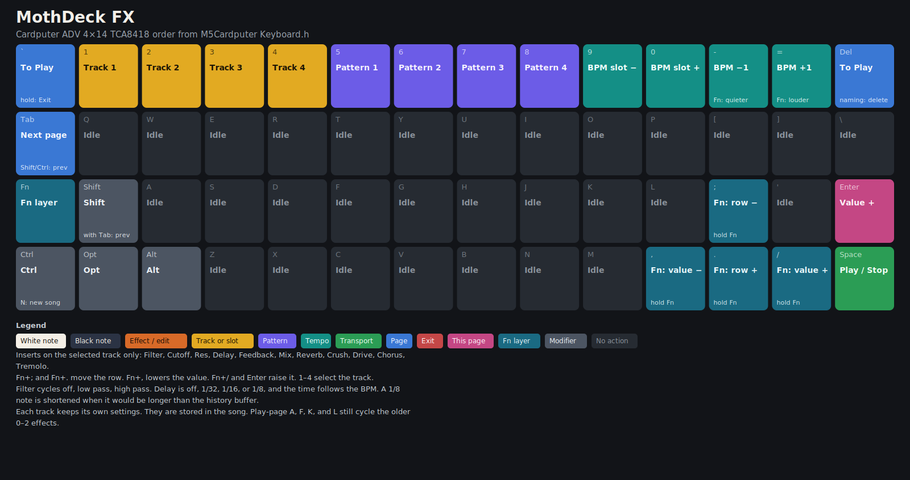

# MothDeck

MothDeck is ambient-house groovebox firmware for the [M5Stack Cardputer ADV](https://docs.m5stack.com/en/core/Cardputer-Adv) (Stamp-S3A, ESP32-S3): drums, a per-track FX insert, a four-track mixer, SD kits and loops, and BLE MIDI. It is a sibling of [MothOS](https://github.com/MothSynths): same song file, same BLE MIDI map, same voice and effect model, redrawn for the ADV's 240×135 colour screen and 56-key keyboard.

## Download the binary

**Use earphones or headphones.** Plug them into the 3.5 mm jack on the side of the Cardputer ADV. This firmware does not play through the internal speaker. The jack is how you hear the drums, the kits, and the loops. Unplugging the earphones does not switch the sound to the speaker.

**Latest Cardputer ADV image (flash this):** [`releases/mothdeck-cardputer-adv.bin`](releases/mothdeck-cardputer-adv.bin)

- SHA-256: `ac13390947360fa20de01e39a5ceb9e564af5612c051aa9a440c347dc976dc72`
- Size: 1,129,152 bytes (app image, magic `E9`)
- This image mixes overlapping drum hits and one-shots on a track, and the insert effects are the smoother full-rate versions. Notes are in [`releases/CHANGELOG.md`](releases/CHANGELOG.md).
- Install notes: [`releases/INSTALL.md`](releases/INSTALL.md) — copy the `.bin` to a FAT32 card, install from [Launcher](https://github.com/bmorcelli/Launcher)
- Optional SD kits/loops: [`releases/mothdeck-sd-pack.zip`](releases/mothdeck-sd-pack.zip) · checksums: [`releases/SHA256SUMS`](releases/SHA256SUMS)


The public source and releases live in this repository. Flash the application image with [releases/INSTALL.md](releases/INSTALL.md). The same overview, with HTML meta tags for search and link previews, is [docs/index.html](docs/index.html).

## Features

- Ambient house drums on the M5Stack Cardputer ADV: twelve distinct hits at the recorded pitch (kick, rim, snare, clap, hats, toms, shaker, ride, snap, crash)
- Groovebox session on the ESP32-S3: 4 tracks, 4 patterns, up to 256 steps of 16th notes
- Per-track FX (filter, delay, reverb, bitcrush, drive, chorus, tremolo) and a mixer with volume, mute, and solo
- SD kits, plugin instruments, and loops. Loops stream from the card instead of filling RAM
- BLE MIDI peripheral (notes, bank, volume, pitch bend)
- Built-in sounds are unsigned 8-bit mono at 22050 Hz so they fit the 8MB flash and the internal SRAM
- One-second amber moth splash, then the Play page, with a checked exit back to Launcher

This repository is the Cardputer ADV firmware. The PlatformIO target is `cardputer-adv`. `cardputer-adv-dev` is that same firmware with SD and speaker logs on USB serial. The board id in `platformio.ini` is `esp32-s3-devkitc-1` because PlatformIO has no Stamp-S3A entry; the pins in `include/BoardConfig.h` are the ADV. There is no second ADV build.

Everything it uses is on the board. There is no wiring. The headphone jack, display, keyboard, and microSD are brought up by M5Unified. The internal speaker does not play with this firmware; use earphones or headphones in the 3.5 mm jack. A card is optional. The built-in drums, sound effects, and tonal instruments are synthesized when the firmware is built. They are not recordings of anyone else's samples.

## Flash it

See [releases/INSTALL.md](releases/INSTALL.md) for the button sequence. Short version:

1. Copy `releases/mothdeck-cardputer-adv.bin` (the file that starts with `E9`) to a FAT32 card.
2. Boot [Launcher](https://github.com/bmorcelli/Launcher), press Enter on its splash, and install that file from the SD browser.
3. The next boot that follows the boot selection starts MothDeck.

`mothdeck-cardputer-adv-full.bin` is a USB flash of the whole chip. It replaces Launcher. Checksums for both images and for `mothdeck-sd-pack.zip` are in `releases/SHA256SUMS`.

Unzip `releases/mothdeck-sd-pack.zip` onto the card root when you want the extra kits, loops, and plugin instruments. You should end up with a `moth` folder at the top of the card. The built-in kit does not need the card.

## Boot

Power-on turns the backlight on, draws an amber moth on a grey panel for about one second, then draws the Play page. The splash does not wait for a key. After Play is on screen, the firmware scans the card, starts the ES8311 headphone output, and starts BLE. That order is what keeps the panel lit and the codec clocked: the codec is not started inside `M5.begin`, and GPIO42 is the codec data line, not an amplifier pin to drive high. Sound comes out of the 3.5 mm jack. The internal speaker stays quiet.

The moth is amber (`0xFD20`) on grey (`0x1082`). An earlier image sent that amber buffer as already byte-swapped RGB565, so the panel showed blue. The splash now marks the buffer as logical RGB565 before `pushImage`. The UI sprite stays RGB565 as well. An 8-bit sprite had to be expanded through the SPI DMA path on every frame, and the loop windows used to sit in static RAM before the speaker and BLE started. Together those reset the ADV a moment after Play. The windows are allocated only when a loop opens. The image that stays on Play is the one in `releases/`.

Hold Esc (the `` ` `` key) or the front button for about 0.7 seconds to leave for Launcher, including during that boot. Exit is offered only when the `APP_TEST` slot holds a real ESP32-S3 app image (header magic `E9`). Otherwise the menu entry is grey, the page says "Launcher not found", and the hold does not erase `otadata`. Details are in [releases/INSTALL.md](releases/INSTALL.md).

## What a session looks like

Tab moves between pages: Play, Instrument, FX, Mixer, Song, Loops, MIDI, Settings, and Exit when Launcher is present. `` ` `` on any page other than Play returns to Play. On Play, a tap of `` ` `` opens the page list. Space is play and stop, except while a menu is open.

There are 4 tracks and 4 patterns, up to 256 steps of 16th notes. Step timing matches MothOS: the mix is 44100 Hz, and one step is `11025 / beats-per-second` samples. Each track keeps its own instrument. Selecting another track recalls that track's instrument. It does not copy the previous one across.

Audio runs on its own task on core 1. The UI reads a snapshot. It does not write the tracker from the draw path. The speaker is fed 256-frame blocks while fewer than two blocks are queued.

## Drums, kits, and the other instruments

The twelve built-in instruments are Drums, SFX, Sine, Square, Saw, Tri, Organ, Pluck, Bell, Flute, Bass, and Pad. The row after Pad is Loops. Plugin folders from the card appear under those.

Drums are twelve different hits, one per pad, played at the recorded pitch. Changing octave plays the same piece again. It does not speed the sample up. The upper row and the lower row of the same key are the same pad.

| Key | Pad | What you hear |
| --- | --- | --- |
| C | Kick | Sub with a click |
| C# | Rim | Short stick |
| D | Snare | Noise snare |
| D# | Clap | Layered clap |
| E | Closed hat | Bright short noise |
| F | Open hat | Longer hat |
| F# | Low tom | Pitched tom |
| G | Tom | Higher tom |
| G# | Shaker | Soft noise |
| A | Ride | Long metallic noise |
| A# | Snap | Short transient |
| B | Crash | Soft cymbal |

On the Instrument page, `,` and `/` load the previous or next kit onto Drums. Fn+`,` and Fn+`/` do the same. The line under the list is the kit name. Index 0 is always the built-in Ambient House kit in flash. Further kits are folders under `/moth/drums`. If the card has none, the toast says "No SD kits". `R` rescans instruments, kits, and loops. Enter assigns the highlighted row to the selected track only.

SFX is twelve different one-shots (riser, downlifter, zap, sweep, impact, noise, blip, siren, reverse, drop, bubbles, whoosh), one per key. Those do follow the octave. Sine through Pad are synthesized per sample: sine is a sine, square is rounded, saw is a detuned lead, triangle is a triangle, organ is drawbar sines, pluck closes a filter and decays, bell is decaying FM, flute is a slow sine with breath, bass is a sub plus detuned saws, and pad attacks slowly, stays detuned, and holds.

## Mixer and FX

These are different pages.

FX is the insert on the selected track: filter (off, low pass, high pass), cutoff, resonance, delay, feedback, mix, reverb send, bitcrush, drive, chorus, and tremolo. Fn+`;` and Fn+`.` move the row. Fn+`,`, Fn+`/`, and Enter change the value. Delay follows the BPM as 1/32, 1/16, or 1/8. Each track keeps its own insert. Inserts are saved only when one is in use, which makes the song file version 3. The Play-page keys A, F, K, and L still cycle the older 0–2 low pass, retrig, wobble, and echo on the selected track.

Mixer shows all four tracks as volume faders, with the instrument name on each and the selected track highlighted. Fn+`;` raises the selected track and Fn+`.` lowers it (0–8). Fn+`,` and Fn+`/` move between tracks. `1`–`4` jump to a track. `M` mutes the selected track and `S` solos it. Volume is stored in every song version.

## Loops

Two ways to use card audio, both reading the same `/moth/loops` libraries.

The Loops page lists libraries and entries. Enter launches the row onto the selected track. `A` auditions. `Q` cycles quantize: now, beat, or bar. `S` stops the loop on the track. `R` rescans. Fn+`,` and Fn+`/` change library.

The Loops instrument (the row after Pad, id 63) is assigned like any other instrument. Notes on that track start one of the audio loops, wrapping if there are fewer loops than keys, lined up with the current bar. Playback follows the project BPM, so a faster song advances the file faster.

A loop is not copied into the heap. Playback reads a short window from the card (1024 frames, double buffered, up to four streams, five hold slots). The window is allocated when the loop opens and freed when it closes. Launch can wait for the next beat or the next bar.

## Memory

Settings prints Free RAM as free heap over the heap size, for example `86/312k`. That is internal SRAM still unused, over the heap the allocator knows about. It is not flash, and it is not a measurement of the whole chip. The legend on that row is the largest contiguous block a load can take. BLE, the screen buffer, and the audio DMA already sit in that heap, so the free number is small on a healthy boot. A `P` suffix would be free PSRAM. This Stamp-S3A has none, so the suffix stays off.

Loads that do not fit say how many kilobytes they need and how many are free (`Need Nk, Mk free`). The previous kit or plugin stays selected. Without PSRAM the caps are:

| What | Limit |
| --- | --- |
| Plugin sample | 4096 frames, 4 loaded at once |
| Drum kit | 8000 frames total, 1800 per pad, one kit cache |
| Loop streams | 4 open, each a small window, not the whole file |

An allocation also leaves about 8KB of internal heap for the rest of the system. A corrupt manifest or WAV is reported on the page and skipped.

## Sample format

Built-in drums, built-in sound effects, the SD pack, and the default output of `tools/wav_to_instrument.py` and `tools/wav_to_loop.py` are unsigned 8-bit mono PCM at 22050 Hz. 128 is silence. That is about 22 KB/s. A 44.1 kHz stereo 16-bit file is about 176 KB/s. The mix stays 44100 Hz and stretches 22050 up to it. Prefer mono. A 16-bit WAV still loads, and stereo is folded to mono. `--raw` on the instrument converter writes little-endian int16 at the source rate.

Regenerate the flash tables with `python3 tools/gen_samples.py` and the card pack with `python3 tools/make_sd_pack.py`.

## Card layout

```
/moth/slot1.mos … slot4.mos
/moth/instruments/<folder>/manifest.txt
/moth/instruments/<folder>/sample.wav    (or sample.raw)
/moth/drums/<kit>/manifest.txt
/moth/drums/<kit>/*.wav
/moth/loops/<library>/manifest.txt
/moth/loops/<library>/*.wav              (or raw, or .pat)
```

The pack in `releases/mothdeck-sd-pack.zip` contains:

| Path | What it is |
| --- | --- |
| `moth/drums/808` | 808-style kit |
| `moth/drums/dusty` | Ambient kit, dulled |
| `moth/loops/house` | Four one-bar loops at 120 BPM (kick, hats, chord, sub), 44100 frames, about 44 KB each |
| `moth/instruments/ep` | Electric piano, one-shot |
| `moth/instruments/reese` | Detuned saw bass, looping |
| `moth/instruments/saw-lead` | Two detuned saws, looping |
| `moth/instruments/soft-pad` | Slow detuned sines, looping |
| `moth/instruments/house-pluck` | Short pluck, one-shot |
| `moth/instruments/air-bell` | FM bell, one-shot |

Kit pad order is kick, rim, snare, clap, hat, openhat, perc, tom, shaker, ride, snap, crash. `perc.wav` is the low tom. Each pad file is already inside the 1800-frame and 8000-frame cache. Plugin samples in the pack are 3600 frames at 22050 Hz, under the 4096-frame cap. A kit folder is `mothdeck-kit 1`, a `name=`, and exactly twelve `pad=` lines.

```bash
python3 tools/wav_to_instrument.py take.wav card/moth/instruments/take --name take --root 60
python3 tools/wav_to_loop.py --name house --bpm 120 --bars 1 --tags drums \
    card/moth/loops/house kick.wav hats.wav
```

Those two commands resample to 22050 Hz and write 8-bit mono WAV. Song, instrument, loop, kit, and pattern bytes are specified in [docs/FORMATS.md](docs/FORMATS.md).

Plugins get ids 12–62. Id 63 is Loops. A song stores the folder name. If that folder is missing at load, the track falls back to the drum bank. A song that stays on the built-in instruments is a 3155-byte MothOS version 1 file. Plugins and loops make version 2. An insert effect makes version 3.

## Keyboard

The drawings follow `src/Ui.cpp` and the 4×14 matrix in M5Cardputer `Keyboard.h`. Regenerate them with `python3 tools/make_keymap.py`. Each key shows the unshifted action. A caption on the key is the Fn action where that differs.





Esc is the grave key. The arrow legends are `;` up, `,` left, `.` down, `/` right, and they only move something while Fn is held, except on the Instrument page where `,` and `/` load kits by themselves. Fn+`-` and Fn+`=` change speaker volume by 12 on every page. Fn plus any other key still does that key's normal action.

Ctrl or Shift substitutes the key's shifted glyph before the UI lowercases it. Letter commands still match. Digit and punctuation commands do not: Ctrl+1–8 is `!@#$%^&*` and does not clear a track or pattern, and Shift+`,` is `<` rather than the high C. Ctrl+N still starts a new song.

| Keys | Action |
| --- | --- |
| Tab | Next page. Shift+Tab or Ctrl+Tab goes to the previous page. While the page list is open, Tab moves the highlight and leaves the list up |
| Space | Play / stop. While a menu is open, Space does nothing |
| `` ` `` tap | On Play, toggle the page list. On any other page, return to Play. While the page list, name editor, or Exit confirm is open, `` ` `` cancels that menu |
| `` ` `` or the front button, held ~0.7s | Exit to Launcher, including during boot |
| 1–4 | Select track. On Song, select a slot and report full or empty |
| 5–8 | Select pattern. On Song, these keys do nothing |
| 9 / 0 | On Instrument, previous / next instrument. Elsewhere, previous / next BPM slot |
| `-` / `=` | Nudge the current BPM slot by 1 (40–240). With Fn, speaker volume ±12 |
| Backspace | On Play, clear the step under the cursor. In the name editor, delete one character. On the page list or Exit confirm, cancel back to Play. On any other page, return to Play |
| Ctrl+N | New song at the current length, without advancing that length |

### Play

`Z X C V B N M ,` are C D E F G A B C for the current octave. Comma is the C above that octave. `S D G H J` are C# D# F# G# A#. `Q` through `]` is the next octave, chromatic. Shift adds an octave on letter notes, Alt adds another, Opt subtracts one. They stack and clamp to four octaves, MIDI C2–B5. On drums, both octaves of a key play the same pad at the recorded pitch.

| Key | Action |
| --- | --- |
| A | Low pass, cycles 0–2 |
| F | Retrig, cycles 0–2 |
| K | Wobble, cycles 0–2 |
| L | Echo, cycles 0–2 |
| `;` | Sends note-length `L` with the stored length. It does not step. The voice stores 4 minus that value. Fn+`;` moves the page list up when the list is open |
| `'` | Toggle sampler mode |
| `\` | Cycle the octave |
| `.` | Copy pattern. Fn+`.` moves the page list down when the list is open |
| `/` | Paste pattern. Fn+`/` does nothing on Play |
| Enter | No action |

Played keys are also sent as BLE MIDI note-on on the selected track's channel.

While the page list is open it takes every key. Fn+`;` and Fn+`.` move the highlight, Tab does the same, Enter stays on the highlighted page, and `` ` `` or Backspace returns to Play. Notes, space, track, pattern, and BPM keys do nothing until the list closes.

### Instrument

`9` / `0` and Fn+`;` / Fn+`.` move the instrument list. Enter assigns the row to the selected track only. The four names across the top of the page are tracks 1–4. `R` rescans. `,` and `/` load drum kits, as described above. 1–4 still select the track and 5–8 the pattern.

### FX

Described above. `` ` `` or Backspace returns to Play.

### Mixer

Described above. `` ` `` or Backspace returns to Play.

### Song

| Key | Action |
| --- | --- |
| 1–4 | Select the slot |
| 5–8 | No action |
| S / L / X / T | Save, load, delete, slot status |
| N | Advance the length (32, 64, 96, 128) and start a new song. From boot the first press is 64 steps |
| C / V / G | Copy pattern, paste pattern, paste all patterns |
| M | Toggle song mode and pattern mode |
| H | Toggle master volume |
| B | Next BPM slot |
| Enter | Load the selected slot |

`9` and `0` still move the BPM slot. Ctrl+N starts a new song at the current length and does not advance it.

### Loops

Described above. Fn+`;` moves the row up and will not pass row 8. Fn+`.` moves down to the last entry.

### MIDI

The page shows connection, the stored name, and the channel map. A stored name longer than 8 characters is shortened in the advertising packet, and the page shows that shorter name in parentheses. `E` jumps to Settings and starts editing the BLE name. Enter does nothing here.

### Settings

Rows: speaker, brightness, BLE name, battery, free RAM, card. Fn+`;` and Fn+`.` move the row. Fn+`,` and Fn+`/` change speaker volume or brightness by 8 when that row is selected (brightness stays at least 10). Enter on the BLE name row starts typing. Enter again applies the name and restarts advertising. On any other row, Enter does nothing. While the name editor is open it takes every key: glyphs are lowercased and appended, up to 16, Backspace deletes one character, and `` ` `` cancels. Space does not play and is not typed.

### Exit

The Exit page is a confirm, and it is in the page list only when a Launcher image is detected. Enter clears the OTA boot selection and restarts toward Launcher. `` ` `` or Backspace returns to Play. Notes, space, track, pattern, and BPM keys do nothing on this page.

## MIDI

Advertised as a BLE MIDI peripheral on legacy connectable advertising. The default name is `MothDeck`. Change it on Settings. The name is stored in NVS. The primary advertising packet is general-discoverable and carries both the name and the 128-bit MIDI service UUID. A stored name longer than 8 characters is shortened there; the full name is in the scan response. Pairing is Just Works with bonding and no passkey. Packets are Apple-style timestamped MIDI, the same codec as MothOS.

| Message | Map |
| --- | --- |
| Note on/off, channel 1–4 | Tracks 1–4. Notes 36–83 are C2–B5 |
| CC 0 / CC 32 bank | Instrument. MSB 0–11 built-in, 12–62 plugin id, 63 Loops. A non-zero LSB still spreads the 14-bit value across the 12 built-ins, as MothOS does |
| CC 1 mod | Low pass |
| CC 7 / CC 39 volume | 14-bit, mapped to voice volume 0–8 |
| Pitch bend | Per channel, ± the voice pitch ratio |

Keypad notes are sent back out as note-on on the track channel. Bank and volume are sent when the matching control changes.

## Build

PlatformIO, pioarduino 55.03.312-1 (Arduino-ESP32 3.3.12). Libraries are pinned: M5Unified 0.2.25, M5GFX 0.2.32, M5Cardputer 1.1.1.

```bash
pip install platformio
./build.sh
```

`build.sh` regenerates the built-in waveforms, the example card tree, runs the host tests, and writes:

- `releases/mothdeck-cardputer-adv.bin` — install this from Launcher
- `releases/mothdeck-cardputer-adv-full.bin` — USB flash only; it replaces Launcher
- `releases/SHA256SUMS`

Host tests alone:

```bash
bash tools/run_tests.sh
```

The image is built `qio_qspi` at 80 MHz. That is the memory type on the Arduino-ESP32 `m5stack_cardputer` board (QIO flash, QSPI PSRAM type, PSRAM left disabled) and on Launcher's Cardputer environment. `-DBOARD_HAS_PSRAM` is not set, so M5GFX does not prefer a PSRAM heap that is not there. `qio_opi` would boot-init octal PSRAM on GPIO33–37, which this board uses for the display.

`partitions/cardputer_adv_8MB.csv` is the development table used by a USB flash and by the linker. Launcher does not use it. Launcher installs the application image into an OTA slot after its own `APP_TEST` image.

## Hardware

Cardputer ADV: Stamp-S3A (ESP32-S3FN8, 8MB flash, no onboard PSRAM), ST7789 240×135, TCA8418 keyboard at I2C `0x34` (SDA 8, SCL 9), ES8311 on the same I2C bus at `0x18`. GPIO42 is the codec data line (DSDIN), GPIO41 is bit clock, GPIO43 is word select, and GPIO46 is the codec microphone data. The NS4150B speaker amp follows the codec, and its enable pin is not a GPIO: the board pulls it on, and the 3.5 mm jack turns it off while a plug is inserted. This firmware still does not play through that speaker. Use earphones or headphones. microSD is a separate SPI bus (SCK 40, MISO 39, MOSI 14, CS 12) with GPIO5 held high before mount. Display pins are MOSI 35, SCLK 36, CS 37, DC 34, RST 33, backlight GPIO38. Battery ADC is GPIO10. The front button is GPIO0. Grove (GPIO1 / GPIO2) is left unused. The IMU is left off.

Octal PSRAM uses GPIO33–37. Those pins are the display, so a PSRAM module cannot be added to this Stamp-S3A, and the firmware stays on `qio_qspi`. Both hardware SPI controllers are already in use, one for the display and one for the microSD. A Grove SPI RAM board is not a supported upgrade. Extra sample room is the microSD: kits and short plugin samples stay in a small RAM cache, and loops are read from the card while they play.

The splash art is `docs/splash-moth.png`. Regenerate the embedded mask with `python3 tools/make_splash.py`.

## Site

GitHub Pages publishes the `docs/` folder on `main`. After that setting is on, the site is:

https://shard76-dark.github.io/MothDeck-ambient-house-groovebox-firmware-for-M5Stack-Cardputer-ADV-/

`docs/robots.txt` allows indexing and names `sitemap.xml`. `docs/sitemap.xml` lists that Pages URL. `docs/index.html` carries the description, Open Graph, Twitter card, and JSON-LD (`SoftwareApplication` and `WebSite`).

## Project layout

```
include/     headers, including the codecs the host tests compile
src/         firmware
test/        host tests (MIDI, song v1/v2/v3, per-track FX, manifests, WAV, synth render)
tools/       sample generator, WAV converters, keymap and splash tools, test runner
docs/        project site (index, robots, sitemap), file formats, keymap drawings, splash art
sd-card-example/
partitions/  development table, not used by Launcher
releases/    application image, full-flash image, SD pack, checksums, install notes
```

## Licence

MIT. Copyright (c) 2024 MothSynths. See [LICENSE](LICENSE).
