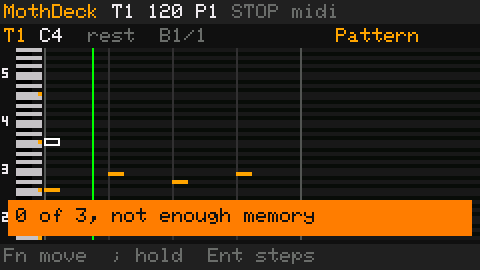
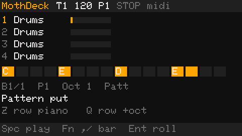
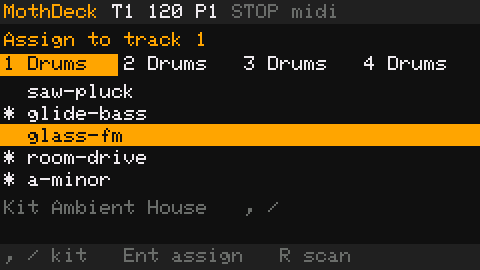
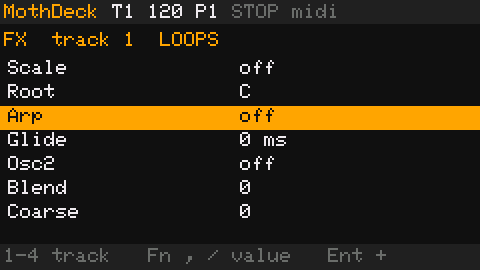
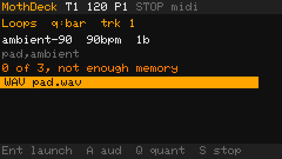
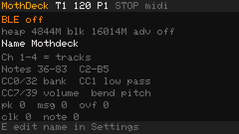
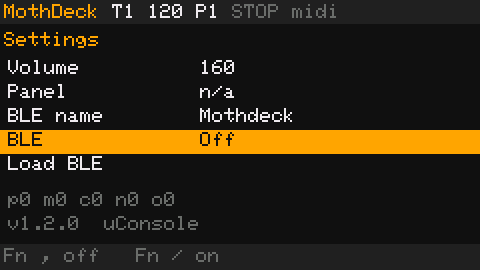
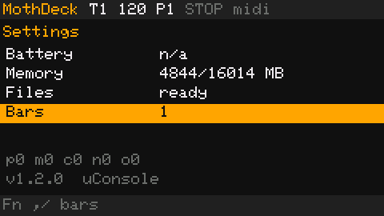
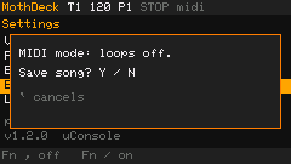

# MothDeck user guide

MothDeck is groovebox firmware for the M5Stack Cardputer ADV. The published image is 1.2.1. The behavior below is the 1.2.2 test: NimBLE is resident from boot, and On and Off only start or stop advertising. Use earphones or headphones in the 3.5 mm jack. The internal speaker stays quiet.

Flash [`releases/mothdeck-cardputer-adv.bin`](../releases/mothdeck-cardputer-adv.bin) from Launcher. The button sequence is in [`releases/INSTALL.md`](../releases/INSTALL.md). Unzip [`releases/mothdeck-sd-pack.zip`](../releases/mothdeck-sd-pack.zip) onto the card root when you want the kits, loops, sample instruments, and patches. Key drawings for every page are in the [README keyboard section](../README.md#keyboard).

The pictures below are screenshots of the MothDeck UI, shown at 2×. The Play, Instrument, FX, Loops, MIDI, and Settings shots are the 1.2.0 screen. The MIDI-mode notice is the 1.2.1 wording. On a 1.2.1 board the Settings version line says `v1.2.1`, and the row that said Free RAM says Radio (`off`, `adv`, or `conn`).

## Moving around

Tab steps through Play, Instrument, FX, Mixer, Song, Loops, MIDI, Settings, and Exit. Exit is in the list only when a Launcher image is on the flash. Shift+Tab or Ctrl+Tab goes back one page.

`` ` `` (the grave key, marked Esc on the drawings) returns to Play from any other page. On Play, a tap of `` ` `` opens the page list. Fn+`;` and Fn+`.` move the highlight, Enter opens that page, and `` ` `` or Backspace closes the list.

Space starts and stops the internal clock, except while a menu is open. Hold `` ` `` or the front button for about 0.7 seconds to leave for Launcher.

There are four tracks. Keys 1–4 select a track. Keys 5–8 select a pattern, and they stop at the last pattern that fits the current length. A pattern is 1 to 8 bars. A bar is 16 sixteenth-notes, so the length is 16 to 128 steps. A new song is 1 bar. The grid is 256 steps: four patterns fit through 4 bars, three fit at 5 bars, and two fit at 6, 7, or 8 bars.

`-` and `=` nudge the current BPM slot by 1 (40–240). `9` and `0` move between BPM slots, except on the Instrument page, where they move the instrument list. Fn+`-` and Fn+`=` change speaker volume by 12 on every page.

## Play

Play opens on a piano roll. Pitch runs down the left, from C2 at the bottom through B5. Time runs across. A note is a filled block one to four steps long. A one-bar pattern draws 8 pixels per step, two bars draw 6, and three bars or more draw 4 and scroll to keep the cursor on screen. While the pattern is playing, the cursor follows the playhead until you move it in time.



| Key | What it does |
| --- | --- |
| Fn+`;` / Fn+`.` | Move the cursor up or down a semitone |
| Fn+`,` / Fn+`/` | Move the cursor one step earlier or later |
| Piano key, stopped | Write that pitch at the cursor |
| Backspace | Delete the note under the cursor |
| `;` on a note | Cycle that note's hold through 1, 2, 3, and 4 steps |
| Enter | Switch to the 16-step strip. Enter again returns to the roll |
| Space | Play or stop |
| A / F / K / L | Cycle the older low pass, retrig, wobble, and echo (0–2) on the selected track |
| `.` / `/` | Copy pattern / paste pattern |
| `\` | Cycle the octave |
| `'` | Toggle sampler mode |

The letter keys are a piano. `Z X C V B N M ,` are C D E F G A B C. `S D G H J` are the black keys. `Q` through `]` is the next octave. Shift adds an octave, Alt adds another, Opt subtracts one. They clamp to MIDI C2–B5. On Drums, both octaves of a key play the same pad at the recorded pitch.

Played keys also go out as BLE MIDI note-on on the selected track's channel. The Cardputer keyboard is one note at a time and does not send note-off.

The 16-step strip is the older view. Fn+`,` and Fn+`/` page the bar (`B3/8` on the bar line). The legend on that view is Space to play, Fn+`,` / Fn+`/` to change bar, and Enter to return to the roll.



A one-step note is stored the same way as older songs. A hold of 2–4 steps uses two spare bits in that same note byte.

## Instrument

The twelve built-ins are Drums, SFX, Sine, Square, Saw, Tri, Organ, Pluck, Bell, Flute, Bass, and Pad. Loops is the row after Pad. Folders from `/moth/instruments` are listed under those. The four names across the top are the instruments on tracks 1–4.



| Key | What it does |
| --- | --- |
| `9` / `0`, or Fn+`;` / Fn+`.` | Previous or next row |
| Enter | Assign the highlighted row to the selected track only |
| `,` / `/`, or Fn+`,` / Fn+`/` | Previous or next drum kit |
| `R` | Rescan instruments, kits, and loops |
| 1–4 / 5–8 | Track / pattern, same as on Play |

Index 0 is the built-in Ambient House kit in flash. Further kits are folders under `/moth/drums`. If the card has none, the toast says `No SD kits`. A kit that does not fit leaves the previous kit selected and the toast says `Kit unchanged`.

Drums are twelve hits, one per pad, at the recorded pitch. Octave does not speed them up. SFX is twelve one-shots that do follow the octave. Sine through Pad are synthesized: sine, rounded square, detuned saw, triangle, drawbar organ, a pluck that closes a filter, decaying FM bell, a flute with breath, a sub plus detuned saws, and a slow pad.

### Patches

A folder whose `manifest.txt` starts with `mothdeck-patch 1` is a patch: a sound that already exists, plus the voice, insert, scale, arp, and glide numbers for one track. The card has no code. Enter assigns it the same way as a built-in. Older `mothdeck-instrument 1` folders still load as samples or cycles.

A sample or plugin that does not fit leaves the previous sound selected. The toast says `Sound unchanged`.

The SD pack includes six sample instruments (`ep`, `reese`, `saw-lead`, `soft-pad`, `house-pluck`, `air-bell`) and six patches:

| Folder | What it is |
| --- | --- |
| `a-minor` | Built-in bass, A minor scale |
| `held-arp` | Built-in saw, held-note arp |
| `glide-bass` | Bass, a second saw an octave down, 90 ms glide |
| `saw-pluck` | Subtractive saw and a low-pass |
| `body` | Short pluck sample |
| `room-drive` | Sine with drive, delay, reverb, and chorus |

A built-in patch uses no extra heap. A subtractive or FM cycle is 336 bytes. A sample stays at most 4096 frames (8192 bytes), and at most four stay loaded. Those stay loaded while BLE is on. Loops do not.

## FX

FX is the insert on the selected track. The list shows seven rows and scrolls. Fn+`;` and Fn+`.` move the row. Fn+`,`, Fn+`/`, and Enter change the value. Keys 1–4 still select the track.



| Row | Values |
| --- | --- |
| Filter | off, low pass, high pass |
| Cutoff, Res | Cutoff 0–127, resonance 0–80 |
| Delay | off, 1/32, 1/16, 1/8, following the BPM |
| Feedback, Mix | Delay feedback 0–70, mix 0–100 |
| Reverb | 0–100 |
| Crush | 0–4 |
| Drive, Chorus, Tremolo | 0–100 |
| Scale | off, major, minor, harmonic minor, mixolydian, phrygian, chromatic |
| Root | C through B |
| Arp | off, pat 1, pat 2, held |
| Glide | 0–500 ms on the device, in steps of 10. A patch file may say up to 2000 |
| Osc2 | off, sine, square, saw, triangle |
| Blend | 0–100, steps of 10 |
| Coarse | −24..24 semitones |

Scale snaps a note from the keyboard, the sequencer, or BLE to the nearest scale tone. A tie goes down. On a sample patch, `root=` is the MIDI note the recording is at, and `scaleroot=` is the scale's pitch class when both are set.

Pat 1 and pat 2 are the older interval walks. Held keeps up to eight MIDI notes that are down and steps to the next one each 16th note. The first note sounds immediately. Releasing the last note stops the track. A held chord comes from BLE, because the Cardputer keyboard does not send note-off.

Glide is the time from the previous note to the new one. The first note snaps. Osc2 is a second oscillator mixed by Blend and transposed by Coarse. It runs on built-in tones and on short samples.

An insert that is in use makes the song file version 3. Scale, a held arp, Osc2, blend, coarse, or glide makes version 4 (at most 3636 bytes). Pat 1 and pat 2 stay in the older voice byte and do not force version 4.

## Mixer

Mixer has no screenshot in this set. It draws four faders, the instrument name on each, and the selected track highlighted. The legend is `Fn ;/. vol   Fn ,/ track   M S`.

| Key | What it does |
| --- | --- |
| Fn+`;` / Fn+`.` | Raise or lower the selected track (0–8) |
| Fn+`,` / Fn+`/` | Previous or next track |
| 1–4 | Jump to a track |
| `M` | Mute the selected track |
| `S` | Solo it |

Volume is stored in every song version. `` ` `` or Backspace returns to Play.

## Song

Song has no screenshot in this set. With a card it lists four slots under `/moth` as saved or empty. Without a card the title is `No SD card` and the slots read `---`. The line under the slots shows the bar count, `song` or `patt`, and the master volume. The on-screen hints are `S save L load X del T stat` and `N new  C copy  V paste  G all`.

| Key | What it does |
| --- | --- |
| 1–4 | Select the slot, and report full or empty |
| 5–8 | No action |
| S / L / X / T | Save, load, delete, slot status |
| Enter | Load the selected slot |
| N | Start a new song one bar longer, wrapping from 8 back to 1. From a 1-bar song the first press is 2 bars |
| Ctrl+N | New song at the current length, without advancing it |
| C / V / G | Copy pattern, paste pattern, paste all patterns |
| M | Toggle song mode and pattern mode |
| H | Toggle master volume |
| B, or `9` / `0` | Next BPM slot |

A song saved with 16 steps loads as 1 bar. A song saved with 32 steps stays 2 bars. Other stored lengths round up to a whole bar, capped at 8. A stored 256-step song loads as four patterns of 64, so the notes stay where they were. A song that stays on the built-in instruments is a 3155-byte version 1 file, the same layout as MothOS. Plugins and loops make version 2.

## Loops

Two ways to use card audio, both reading `/moth/loops`.

The Loops page lists libraries and entries. The header shows the quantize (`now`, `beat`, or `bar`) and the track. Each row is `WAV` or `PAT`.



| Key | What it does |
| --- | --- |
| Enter | Launch the row onto the selected track |
| `A` | Audition |
| `Q` | Cycle quantize: now, beat, bar |
| `S` | Stop the loop on the track |
| `R` | Rescan |
| Fn+`,` / Fn+`/` | Change library |
| Fn+`;` / Fn+`.` | Move through the entries |

The Loops instrument (the row after Pad) is assigned like any other instrument. Notes on that track start one of the audio loops, lined up with the current bar. Playback follows the project BPM.

A loop is not copied into the heap. Playback reads a short window from the card. If the windows cannot hold every audio loop, the page and the toast say `Loops: N of M ready`.

While BLE is on, this page says `MIDI mode: loops off` and `Turn BLE off to load them`. Enter, `A`, and the Loops instrument do not open a stream. The legend points at Settings, Fn+`,`, BLE off.

With no card the page says `Insert a card for loops` and `/moth/loops/<name>/`.

## MIDI

The MIDI page shows the radio state, the stored name, the channel map, the heap line, and the counters.



At boot the status is `BLE off`. It says `MIDI advertising` only while the controller is advertising, and `MIDI connected` while a host is connected. If the stack cannot start, the status says `restart` or `BLE off`. The next line is the free internal heap and the largest free block (`heap` and `blk`). Those numbers stay on this page. The release Settings screen does not repeat them.

While a host is connected, the status row also shows the negotiated interval, for example `link 15.0ms`. Under the map it counts packets, parsed messages, overflows, clocks, and notes (`pk`, `msg`, `ovf`, `clk`, `note`). `E` jumps to Settings and starts editing the BLE name. Enter does nothing on this page.

The air name is `Mothdeck`. A stored name longer than 8 characters is shortened in the advertising packet, and the page shows that shorter name in parentheses.

### Pairing an MPC Live II

1. Turn BLE on in Settings first.
2. On the MPC: Menu, Preferences, Bluetooth, Pair, then Connect.
3. MIDI / Sync, and enable Mothdeck on the input ports.
4. Turn Sync receive on when the MPC should run the clock.

If the MPC still has a bond for the old name `MothDeck`, forget that device and pair `Mothdeck`. Pairing is Just Works, no passkey. The name and the MIDI service UUID are both in the primary advertising packet.

Channels 1–4 play tracks 1–4. Any other channel plays the track already selected. Notes 36–83 are C2–B5. Note On with velocity 0 is Note Off.

| Message | What it does |
| --- | --- |
| CC 0 / CC 32 | Bank. MSB 0–11 is a built-in, 12–62 a plugin, 63 Loops |
| CC 1 | Low pass |
| CC 7 / CC 39 | Volume, mapped to 0–8 |
| Pitch bend | Per channel |
| Clock `0xF8` | 24 per quarter note. Six clocks advance one step. Tempo is averaged over one beat of those clocks |
| Start `0xFA` | External sync, current pattern, bar 1 step 1 |
| Continue `0xFB` | Resume, no jump |
| Stop `0xFC` | Stop and leave external sync. Space returns to the internal clock |
| Song position `0xF2` | Sixteenth-note index, modulo the pattern length |

The link asks for 7.5–15 ms a quarter of a second after connect. If the MPC accepts 15 ms, expect about 25 ms end to end. If it stays at 30 ms, expect about 40 ms. The page shows the number that was negotiated. These are estimates from the buffer sizes. BLE in 1.2.1 has not been tried on a Cardputer.

Auto-length watches for Start, or a Song Position of 0, after a whole number of bars of clocks, and rounds to 1–8 bars. The MPC Live II keeps the clock running through a sequence loop and does not send Start there. When nothing comes back to zero, the length stays as set on the device.

## Settings

Fn+`;` and Fn+`.` move the row. Fn+`,` and Fn+`/` change the selected row.



Rows, top to bottom: Speaker, Brightness, BLE name, BLE, Unload BLE (or Load BLE after an unload), Battery, Radio, Card, Bars. The 1.2.0 shot above labels the Radio row Free RAM and prints a kilobyte line. 1.2.1 does not. That row says `off`, `adv`, or `conn`. The dev build still uses the row for a heap readout.

| Row | Keys |
| --- | --- |
| Speaker, Brightness | Fn+`,` and Fn+`/` change the value by 8. Brightness stays at least 10 |
| BLE name | Enter starts typing. Glyphs are lowercased and appended, up to 16. Backspace deletes one. Enter applies the name and restarts advertising when the radio is on. `` ` `` cancels. Space does not play and is not typed |
| BLE | Fn+`,` turns the radio off. Fn+`/` turns it on |
| Unload / Load | Enter stores the choice |
| Bars | Fn+`,` and Fn+`/` set the pattern length from 1 to 8 bars and leave the notes in place |



BLE is off at boot, and Rec is off at boot. The stack is still initialised, before the loop windows, so turning it on does not allocate. Off stops advertising, disconnects a host, ignores incoming MIDI, and loads the loop windows that fit beside the stack. On turns Rec off and starts advertising. The choice is stored. A 1.1.1 setting of on is not read, so the radio stays off until you turn it on.

### MIDI mode and loops

If the open project has a loop on a track, or a track on the Loops instrument, turning BLE on asks whether to save. It is a mode notice, not an error:



The box says `MIDI mode: loops off.` and `Save song? Y / N`. `` ` `` cancels and leaves BLE off. The toast then says `BLE stays off`. Y saves, N skips, and either one then loads an empty project and turns BLE on. A patch that only uses a built-in, a cycle, or a short sample does not raise this question.

Unload BLE stores the choice and skips the stack on the next boot, so the loop windows can use that block. This session does not tear the stack down. The row says `next boot` and the toast says `BLE unloads after restart`. Fn+`,` before the reboot cancels the unload. After that boot the BLE row says `unloaded`. Enter on Load BLE stores the choice and the toast says `BLE loads after restart`. The next boot initialises the stack before the loop windows.

## Exit

Exit has no screenshot in this set. It is a confirm, and it is in the page list only when a Launcher image is detected. Enter clears the OTA boot selection and restarts toward Launcher. `` ` `` or Backspace returns to Play. Notes, space, track, pattern, and BPM keys do nothing on this page.

## Notices

1.2.1 keeps diagnostic kilobyte numbers on the MIDI page and in the dev build's serial log. Nothing else on the release screen names memory or RAM.

| Situation | What the screen says |
| --- | --- |
| BLE on, and the song has loops | `MIDI mode: loops off.` / `Save song? Y / N` / `` ` `` cancels |
| Loops page while BLE is on | `MIDI mode: loops off` / `Turn BLE off to load them` |
| A loop library that cannot open every file | `Loops: N of M ready` |
| BLE cannot start | The row says `restart`. The toast says `BLE loads after restart` |
| A kit that does not fit | `Kit unchanged` |
| A plugin or sample that does not fit | `Sound unchanged` |

## Card

```
/moth/slot1.mos … slot4.mos
/moth/instruments/<folder>/manifest.txt
/moth/drums/<kit>/manifest.txt
/moth/loops/<library>/manifest.txt
```

Song, instrument, loop, kit, and patch bytes are specified in [FORMATS.md](FORMATS.md).
